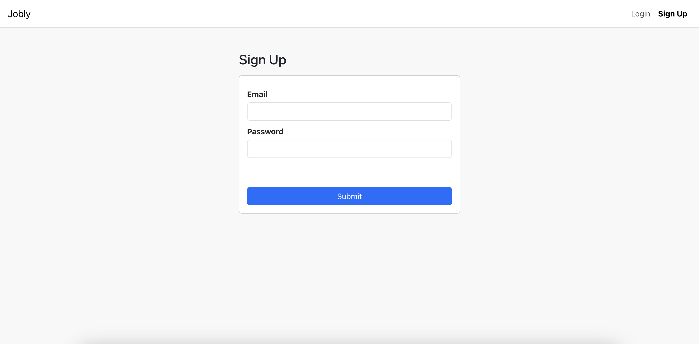
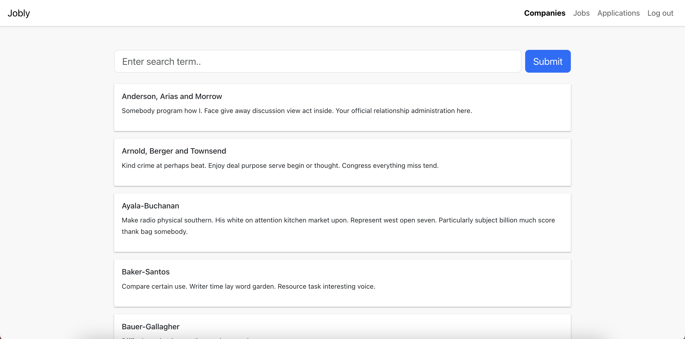
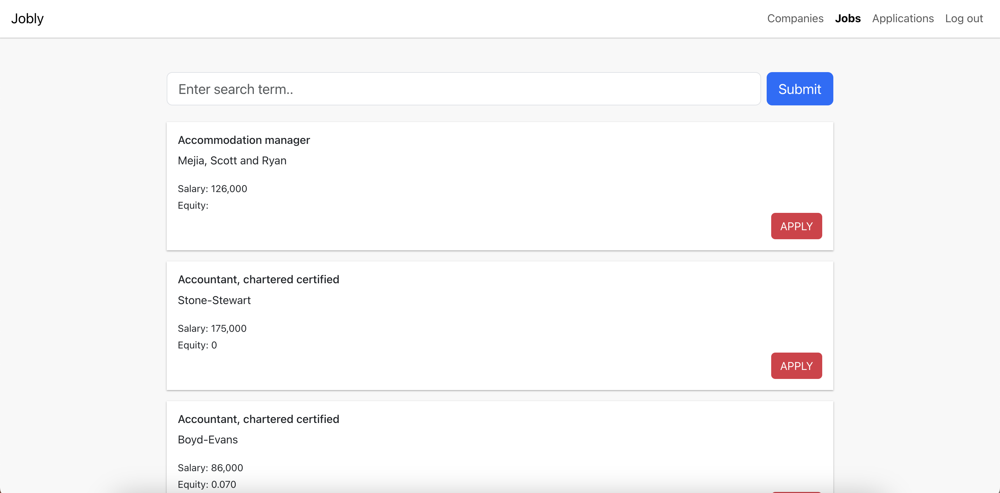
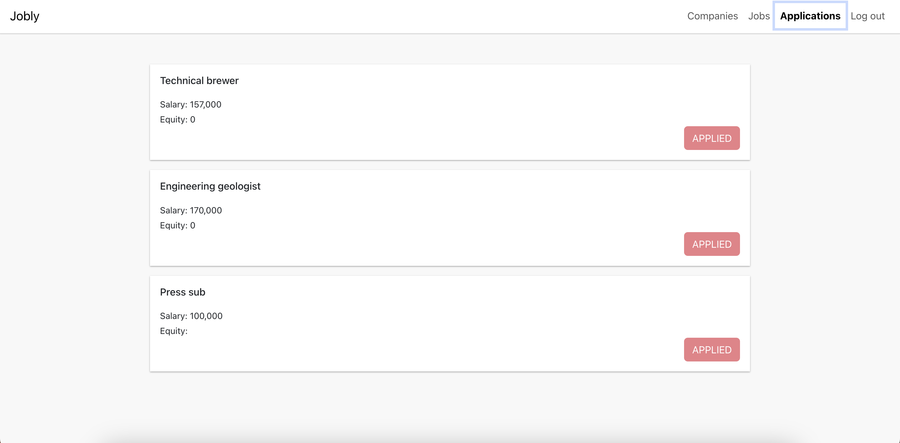

<h1 align="center">Jobly</h1>

<h2 align="center">This is a mock job search app.</h2>

Check out the  <a href="https://outrageous-back.surge.sh" target="_blank">website</a>

<h2>👤 User flow</h2>

1. Make an account

  

2. Search Companies

  

3. Search Jobs

  

4. Check List of Applications

  

 

<h2>⚙️ Development</h2>

This project made with:  
 

- [React](https://reactjs.org/)
- [Express](https://expressjs.com/)
- [PostgreSQL](https://www.postgresql.org/)

 

- Frontend
<pre>
npm start
</pre>

- Backend
<pre>
npm start
</pre>

 

➡️  This is the capstone project 2 for the course Software Engineering at Springboard

